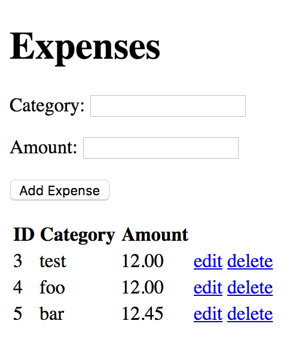
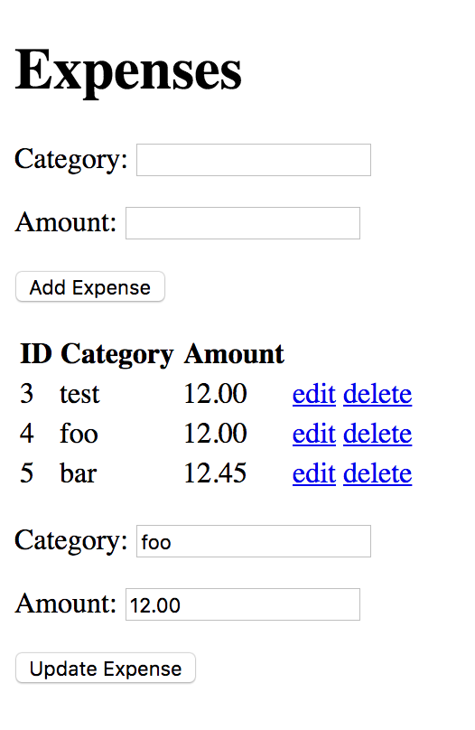

# $http Service

Create an Angular application that allows users to CRUD data from a server.

## Requirements

Your goal is to build a compact CRUD app that allows you to:

- List expenses
- Create expenses
- Update expenses
- Delete expenses





## API Endpoints

- GET `/api/expenses`
  - Response Body: `[{id: 1, category: "foo", amount: 1.0}, ...]`
- POST `/api/expenses`
  - Request Body: `{category: "foo", amount: 1.0}`
  - Response Body: `{id: 1, category: "foo", amount: 1.0}`
- PATCH `/api/expenses/:id`
  - Request Body: `{category: "foo", amount: 1.0}`
  - Response Body: `{id: 1, category: "foo", amount: 1.0}`
- DELETE `/api/expenses/:id`

## Setup

Run `yarn` and `npm start` to see the app locally.

Run `npm test` to run the tests.

> Check the "test/screenshots" folder for examples of what each test is looking for.

## Hint

Search the project for `TODO` to help you find some of the places where you need to make changes.

## HTML

Use the following HTML snippets to get started so that the test suite can find the correct elements:

**New Expense Form**

```html
<h1>Expenses</h1>

<form ng-submit="$ctrl.addExpense()">
  <p>
    Category: <input id="new-category">
  </p>
  <p>
    Amount: <input id="new-amount">
  </p>
  <p>
    <button type="submit">Add Expense</button>
  </p>
</form>
```

**List of Expenses**

```html
<table>
  <thead>
    <tr>
      <th>ID</th>
      <th>Category</th>
      <th>Amount</th>
    </tr>
  </thead>
  <tbody>
    <tr>
      <td></td>
      <td></td>
      <td></td>
      <td>
        <a href="#">edit</a>
        <a href="#">delete</a>
      </td>
    </tr>
  </tbody>
</table>
```

**Edit Expense Form**

```html
<form>
  <p>
    Category: <input id="edit-category">
  </p>
  <p>
    Amount: <input id="edit-amount">
  </p>
  <p>
    <button type="submit">Update Expense</button>
  </p>
</form>
```
